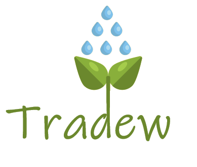

# Tradew Infrastructure

<div align="center"></div>

## Overview
This project is responsible for provinding the system infrastructure as code, it creates:
 - A VPC
 - A RDS Cluster
 - A EKS Cluster
 - Helm Charts (work in progress...)
 - EFK deployment (work in progress...)

## Usage
To start running this project you should first create a S3 bucket on AWS and replace the bucket name in the `provider.tf` file.
```
terraform {
  backend "s3" {
    bucket = "<INSERT-NEW-BUCKET-NAME>"
    key    = "tradew-main.tfstate"  # you can replace this name if you wanted
    region = "us-west-2"            # you also could replace the region
  }
}

```

<br/>

After the bucket is created you can start running Terraform commands. Go to the root of the project workspace and run the command:
```
terraform init
```
It may take a while to download all the depencies. You can now run:
```
terraform apply
```
`(Reminder your the AWS profile that you profile in the variables MUST have write permissions on the S3 bucket)`

You will be prompt to pass in some variables, you would need to pass all the variable for every `apply`, but you can also create a file on the root of the workspace called `terraform.tfvars`. Here you will pass all variable needed to run the `apply` command (see [terraform.template.tfvars](./terraform.template.tfvars) for all variables).

After the you created `terraform.tfvars` you should be able to run:
```
terraform apply
```

## Destroy
To clean all the resources you just created, you can run:
```
terraform destroy
```
It may take a while but all the resources created will be deleted.